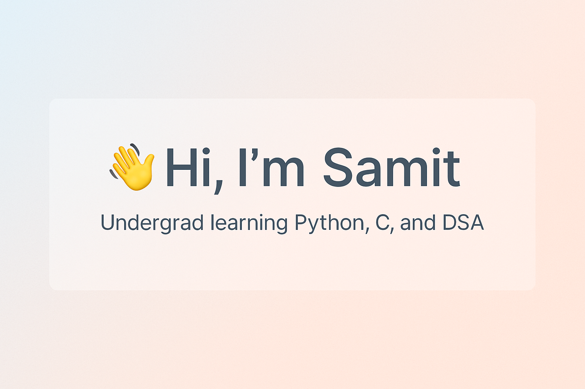

# Hi, I'm Samit :)

I'm an undergraduate passionate about building strong fundamentals in programming and software development. Currently, I'm learning:

-  Python  
-  C Programming  
-  Data Structures (using C)

---

## What I'm Exploring

- Software development practices and clean code
- Full-stack web development (front-end & back-end)
- Open-source contribution and collaboration

---

## 🛠️ Tech Stack (In Progress)

```text
Languages:   Python • C
Concepts:    Data Structures • Problem Solving
Tools:       Git • GitHub • VS Code

